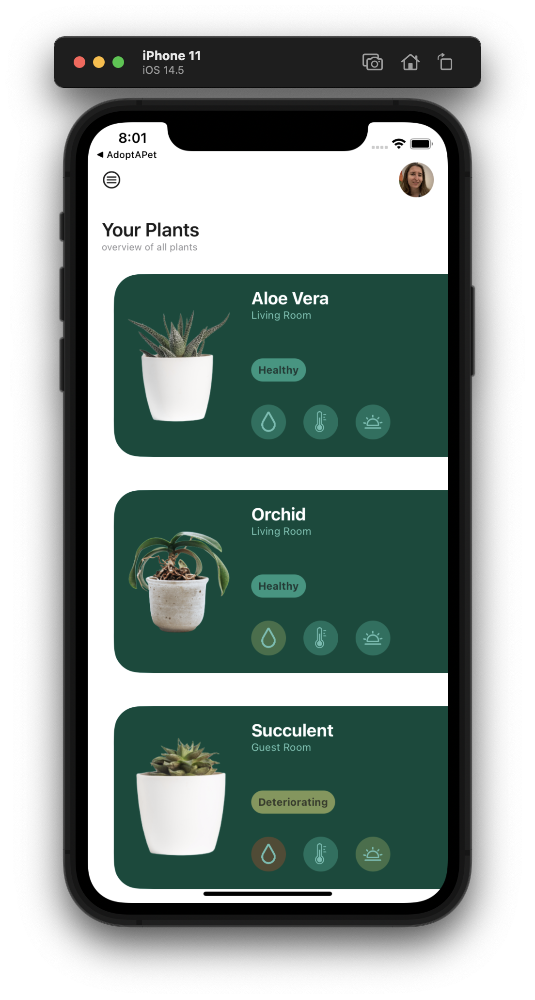
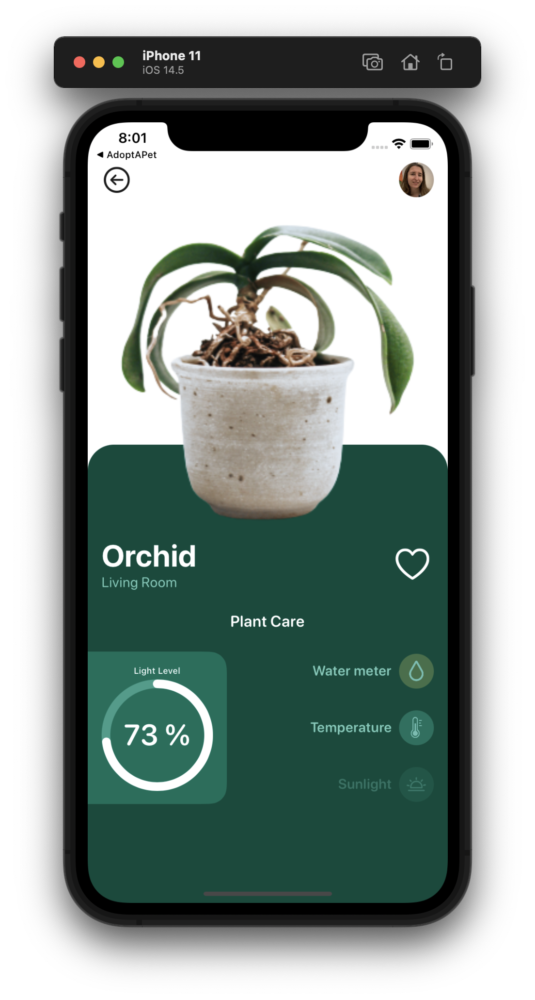

# Plant Care App UI #

SwiftUI implementation of [Plant Care App UI](https://dribbble.com/shots/16232579-Plant-care-app-UI) design by [Mthokozisi Nxumalo](https://dribbble.com/mthonxumz) from dribbble.com.

  
  

# Image Credits: #

[Orchid](https://www.pexels.com/photo/green-leafed-orchid-plant-on-pot-1309769/) by [shottrotter](https://www.pexels.com/@shottrotter).

[Aloe Vera and Succulent](https://www.pexels.com/photo/aloe-vera-and-succulent-plant-in-white-ceramic-pot-1445419/) by [nietjuh](https://www.pexels.com/@nietjuh).

[Water Drop](https://thenounproject.com/search/?q=water+drop&i=1372954) by Bhuvan from the Noun Project.

[Temperature](https://thenounproject.com/search/?q=temperature&i=1979336) by Vectors Market from the Noun Project.

[sunrise](https://thenounproject.com/search/?q=sunrise&i=2082625) by Rodolfo Alvarez from the Noun Project.